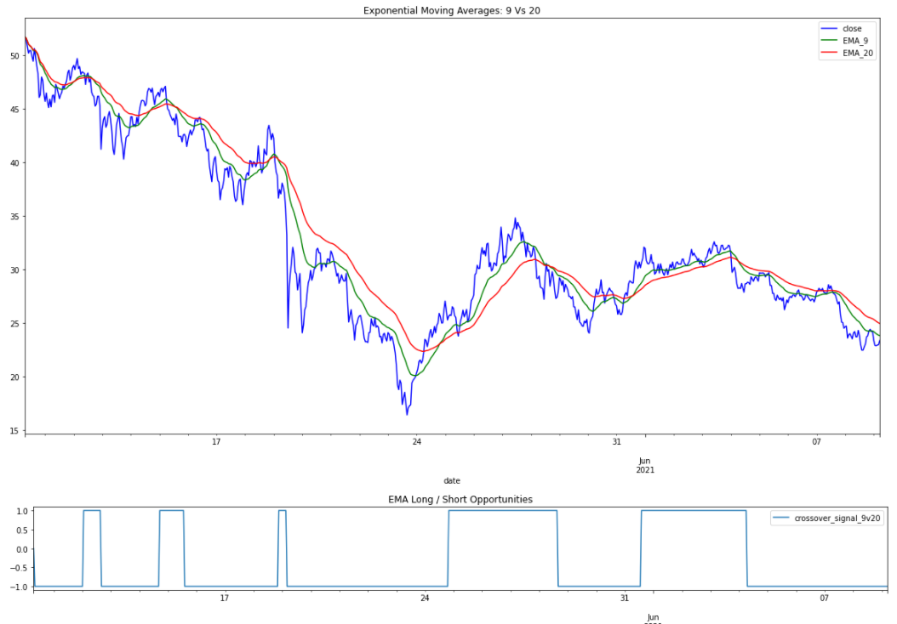
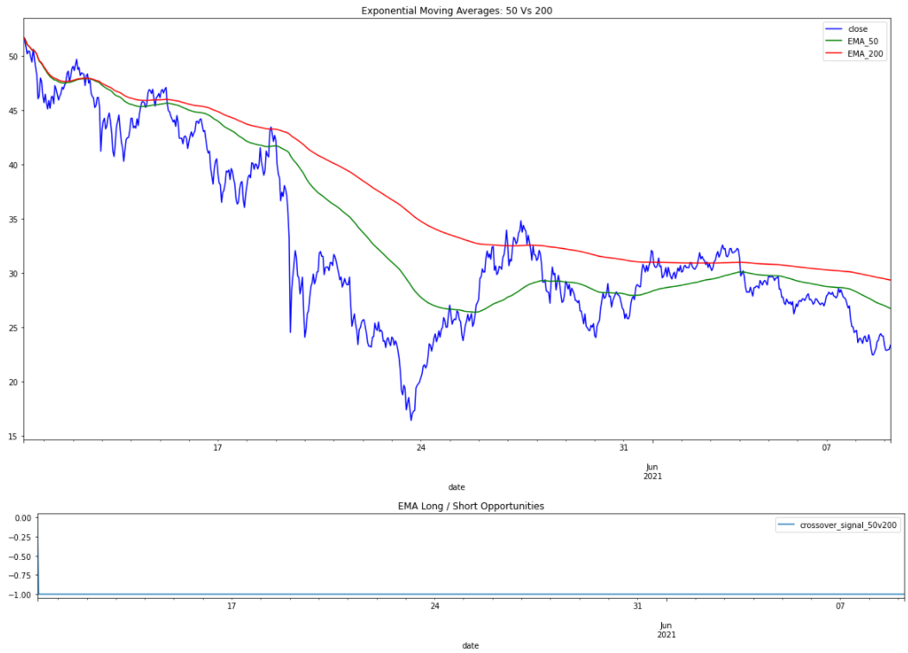
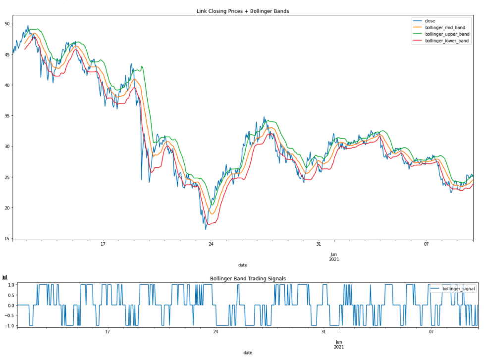
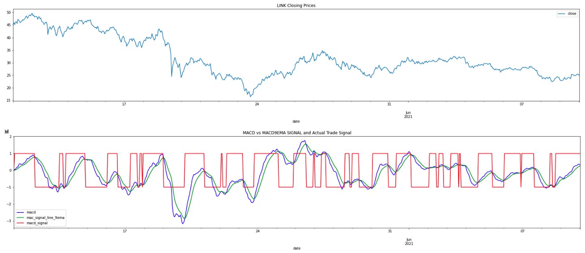

# Project 2 - Monash Fintech  
## Team: Wen G-Wagon  
### Sreeni, Briar, Tas & Alex  
#### [Please see Project_2_Wen_G_Wagon.pdf for project scope guidelines]
 
 
 

# Leveraging Technical Analysis Indicators and Machine Learning to Develop Passive Trading Strategies 
<!--  -->
 

## 1. Idea Development

We developed our idea by combining our week 15 learnings (on algorithmic trading) with key trading strategy logic popularly promoted by day traders on Youtube. There's a general consensus amongst the trading community that a good trading strategy should comprise of at least **three technical indicators.** 

**Technical Indicators We Explored**
* [EMA 50 vs 200](https://www.orbex.com/blog/en/2014/11/trading-200-50-ema-h4-time-frame-trading-strategy-2) 
* [EMA 9 vs 20](https://www.forexfactory.com/thread/89346-how-to-use-the-920-ema-setup-effectively)
* [MACD](https://www.investopedia.com/terms/m/macd.asp)
* [RSI](https://www.investopedia.com/terms/r/rsi.asp)
* [Bollinger Bands®](https://www.investopedia.com/terms/b/bollingerbands.asp)

 

After exploring several free APIs for sales data, we hit an early roadblock in that few sites provided more than 720 periods of data. On our first attempt to program a three-criteria trading strategy, there were very few instances in which you had 3x 'buy' or 3x 'sell' signals. As such, we agreed to **cull each strategy back to just two technical indicators.**

 

To make things fun, we each put forth our own ideas for trading strategies comprising of two technical indicators each:

| Strategy   | Owner    | Indicator 1     | Indicator 2     |
| ---------- |:--------:| ---------------:| ---------------:|
| 1          | Tas      | EMA50 vs EMA200 | Bollinger Bands |
| 2          | Briar    | RSI             | MACD            |
| 3          | Sreeni   | EMA50 vs EMA200 | MACD            |
| 4          | Alex     | EMA50 vs EMA200 | EMA9 vs EMA20   |

 

Unlike the week 15 activities, we also wanted our strategies to be able to **enter long positions as well as short positions**. This was a further nod to the popularly expressed opinion amongst the crypto day-trading community that you should only ever:
* Enter a **LONG** position (1) during a **BULL MARKET**
* Enter a **SHORT** position (-1) during a **BEAR MARKET**

 

After building and exploring all of our strategies, the question was asked whether we could leverage the indicators we had already built, to train some sort of **Machine Learning Trading Model**, and whether or not that model would outperform either of our strategies [To be explored at end].

 
 

***

 

## 2. Building Indicators

 

### 2.1 Building EMA Indicators
 

The construction of an EMA variable is pretty straightforward. Both the `9vs20 EMA` and the `50 Vs 200 EMA` strategies give signals based on the value of the **fast signal** (i.e. 9 or 50) relative to that of the **slow signal** (i.e. 20 or 200). When the 'fast signal' is above the 'slow signal', there's said to be a buying/long opportunity. Inversely, when the slow signal is higher than the fast signal, there's said to be a 'selling/shorting' opportunity. From there, it's a simple matter of programming the position signal for both indicators to `1` when there is a long opportunity, and `-1` if there is a short opportunity.

 

**Outcome of the EMA9V20**

 
 

**Outcome of the EMA50V200**

 

 

As you can see, the EMA50vs200 chart showed that in each of the past 720 periods, the slow 200EMA was above that of the 50EMA. This indicates that for the strategies utilising this indicator, only short / sell opportunities would exist. By contrast, the 9vs20EMA shows a lot more buy and sell signals.

 

### 2.2 Bollinger Bands

With Bollinger Bands, you get a 'buy' signal the second the price action drops over one standard deviation below the current 20-period rolling mean closing price. Similarly, 'buy' signals appear when the price drops below one standard deviation below. 

However, after backtesting this signal a few times, we realised that entering a trade the instant price moves outside the 1stdev range is a recipe for trouble. Often, it is simply the first of 3 to 5 periods in which the price continues to rise/fall outside of the range. The implication here being, if you enter a lopng period on the first signal, price is likely to continue to fall, costing your bottom line.

As such, we updated our 'signals' code to only provide a buy/sell signal on the first candle in which price returns back into the `MEAN +- 1 STD` range. Furthermore, as buy/sell signals disappear quickly, the 'signal / position'.

 
 

### 2.3 MACD

The MACD is renowned for being amongst the most popular and widely-used trading indicators. The MACD value/line itself is derived from taking the 26-period EMA from the 12-period EMA. This can be seen as the 'fast signal'. 

Importantly, the macd is plotted in relation to the 9-period EMA 'Signal' line (Read: slow signal). When the MACD line is above the signal line, a buying opportunity exists. When it is below, a selling opportunity exists.

Importantly, many day-traders utilise the MACD for **confirmation.**. I.e. If they believe, based on other indicators, that a surge/drop is coming, they will WAIT for the relevant macd crossover prior to entering the trade.

 

 

### 2.4 Relative Strength Index (RSI)

The RSI is a popular momentum indicator used to determine when a market is overbought or oversold. The exact mathematics behind our code can be viewed [here.](https://www.investopedia.com/terms/r/rsi.asp). Generally speaking though, when the RSI hits a value below 30, it is deemed to be 'oversold' and thus 'undervalued'. Hence, a long/buy opportunity may exist in anticipation of an upcoming boost in price. Conversely, when the RSI is above 70, it is deemed to be 'overbought' and hence the price is 'overvalued'. As such, a short/sell opportunity may exist in expectation of an upcoming correction (price drop).

From a programming perspective, the RSI can be viewed as being quite similar to Bollinger bands. For example, it isn't recommended to enter a long position the instant the RSI drops below 30, as the trend which pushed it below may continue for several more periods, pushing price down further and further. This would lead to instantaenous unrealised losses. If the RSI was being used solely as an 'entry signal', it would be wiser to time the entry on the first period in which the RSI closes above 30 once again.

However, in this instance, we aim to use the RSI in place of a 'macro trend indicator' only for strategy 2 (in combination with the MACD). Many day traders use the RSI as an initial suggestion that a smart trade may be coming up, before waiting for a **confirmation** to actually enter the trade. As an example, if the RSI breaches 70, this might suggest to a trader that a short/sell opportunity may arise soon. They would then wait for a confirmation in the short few periods following. In our case, the `macd signal line` crossing above the `macd`. 

 

As such, we programmed the RSI, such that buy/sell signals would linger for several periods following the RSI re-entering a 'fair' price range. The results can be seen in as follows:

 

 
 

***

 
 

## 3. Building Strategies

After building the signals, the next task was to build the strategies. A quick refresher on what they were:

| Strategy   | Owner    | Indicator 1     | Indicator 2     |
| ---------- |:--------:| ---------------:| ---------------:|
| 1          | Tas      | EMA50 vs EMA200 | Bollinger Bands |
| 2          | Briar    | RSI             | MACD            |
| 3          | Sreeni   | EMA50 vs EMA200 | MACD            |
| 4          | Alex     | EMA50 vs EMA200 | EMA9 vs EMA20   |
 

### 3.1 Strategy 1: EMA50V200 + Bollinger Bands
 
 Combining the EMA50V200 indicator with the Bollinger bands wasn't as straightforward as it sounds. Comparing the current Bollinger position to the previous (1-period shifted) value was paramount in terms of determining the logic for the strategy.

|#   | EMA50v200 | BOLL | BOLLSHIFT       | INTERPRETATION                               |
|----| ----------|:----:| ---------------:|---------------------------------------------:|
|1   | -1        |  1   |   1             |  HOLD NO POSITION                            |
|2   | -1        |  1   |   0             |  HOLD NO POSITION / CLOSE SHORT POSITION     |
|3   | -1        |  1   |   -1            |  CLOSE SHORT POSITION                        |
|4   | -1        |  0   |   1             |  HOLD NO POSITION                            |
|5   | -1        |  0   |   0             |  HOLD POSITION                               |
|6   | -1        |  0   |   -1            |  HOLD SHORT POSITION                         |
|7   | -1        |  -1  |    1            |  CLOSE LONG, ENTER SHORT                     |
|8   | -1        |  -1  |    0            |  ENTER SHORT                                 |
|9   | -1        |  -1  |  -1             |  HOLD SHORT                                  |
|10  | 1         | 1    | 1               |  HOLD LONG                                   |
|11  | 1         | 1    | 0               |  ENTER LONG                                  |
|12  | 1         | 1    | -1              |  CLOSE SHORT, ENTER LONG                     |
|13  | 1         | 0    | 1               |  HOLD LONG                                   |
|14  | 1         | 0    | 0               |  HOLD POSITION                               |
|15  | 1         | 0    | -1              |  HOLD POSITION                               |
|16  | 1         | -1   |   1             |  CLOSE LONG                                  |
|17  | 1         | -1   |   0             |  HOLD POSITION / CLOSE LONG                  |
|18  | 1         | -1   |   -1            |  HOLD NO POSITION                            |

 

Fortunately, in 11 of the above 18 possible scenarios, the interpretation is to hold. This was easily accounted for with an 'else' statement (i.e. else: position = previous position). This meant that only scenarios 3,7,8,11, 12 and 16 required specific programming.

 

The below graph showcases the EMA50v200 signals, the bollinger signals, as well as the positions taken based on the two signals coinciding.

 

### 3.2 Strategy 2: RSI + MACD

 

### 3.3 Strategy 3: EMA50V200 + MACD

 

### 3.4 Strategy 4: EMA50V200 + EMA9V20

 
 

***

 

## 4. Machine Learning Model Development